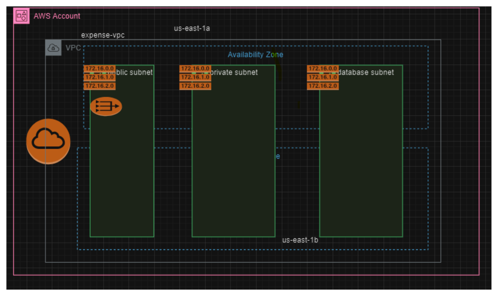

this module is evelped for joindevops.com
we r cretaing following resources
this module creates resources in  first 2 az for HA 
* vpc
* ig
* ig and vpc attachments
* 2 public subnets
* 2 private subnets
* datbase subnets

## inputs
* project-name (required) : user should mention project name 
* environment (optional) : default value is dev.type is string
* common_tags (required) : user should provide their tags related to
their project.type is map
* vpc_cidr(optional) : default value is 10.0.0.0/16.type is string
* enable_dns_hostnames(optional) : default valiue is true . type is bool
*vpc_tags(optional) : default value is empty : type is map.
* igw_tags(optional) : default is empty: type is map
* public_subnet_cidrs (required) : user has to provide 2 valid subnet CIDR.
* public_subnet_cidr_tags(optional) : defult value is empty.type is map
* private_subnet_cidrs (required) : user has to provide 2 valid subnet CIDR.
* private_subnet_cidr_tags(optional) : defult value is empty.type is map
* database_subnet_cidrs (required) : user has to provide 2 valid subnet CIDR.
* database_subnet_cidr_tags(optional) : defult value is empty.type is map
* database_subnet_group_tags(optional) : defult value is empty.type is map
* nat_gateway_tags(optional) : default value is empty. type is map
* public_route_table_tags(optional): default value is empty.type is map.
* private_route_table_tags(optional): default value is empty.type is map.
* database_route_table_tags(optional): default value is empty.type is map.
* is_peering_required(optional):default value is false.type is bool
* acceptor_vpc_id(optional):default value is empty,default vpc ID would be taken .type is string.
* vpc_peering_tags(optional): default is empty.type is map

